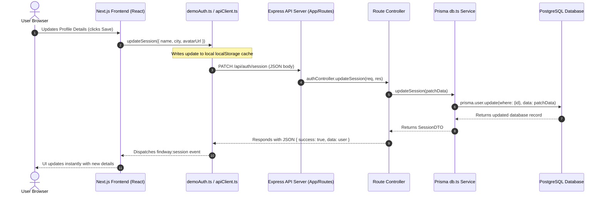
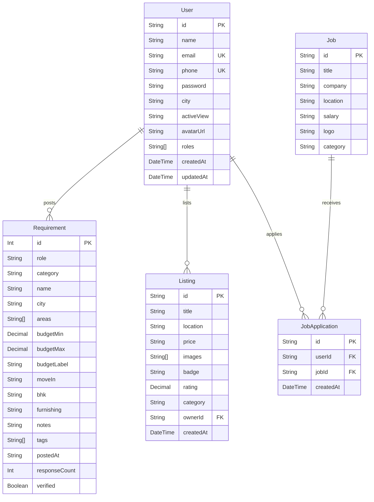

# Project Architecture & Database Wireframe Guide

This guide explains the directory structure, data flow, and database schema for the **Manikya** application. It incorporates the recently implemented **PostgreSQL** and **Prisma** backend configuration.

---

## 📂 1. Directory Tree & Architecture

The application is split into a **Next.js Frontend** (port 3000) and an **Express.js Backend** (port 4000).

```
new manikya_app/
│
├── manikya-backend/              # Express + TypeScript API Server (Port 4000)
│   ├── prisma/
│   │   ├── schema.prisma         # Prisma Schema (PostgreSQL Models)
│   │   └── migrations/           # PostgreSQL Migration history
│   ├── data/
│   │   └── db.json               # Legacy mock JSON database (used for backup/seeding)
│   ├── src/
│   │   ├── controllers/          # HTTP request handlers (authController, requirementsController, etc.)
│   │   ├── routes/
│   │   │   └── api.ts            # Route paths mapped to controllers
│   │   ├── services/
│   │   │   ├── db.ts             # Prisma Database service (PostgreSQL queries)
│   │   │   └── mockDb.ts         # Legacy JSON file data service (deprecated)
│   │   ├── lib/
│   │   │   └── prisma.ts         # Prisma Client instantiation
│   │   ├── app.ts                # Express app setup (CORS, body-parser, routes registration)
│   │   └── server.ts             # Node server listener entry point
│   ├── .env                      # Database credentials (DATABASE_URL)
│   └── tsconfig.json
│
└── manikya-nest-next/            # Next.js Frontend (Port 3000)
    ├── src/
    │   ├── app/                  # Next.js Pages & Layouts (App Router)
    │   │   ├── explore/          # Categories and search
    │   │   ├── profile/          # User Dashboard, upgrades, matching logic
    │   │   │   └── share/[id]/   # Public-facing shared profiles
    │   │   └── requirements/     # Requirements feed and creation form
    │   ├── components/           # Reusable UI components
    │   │   ├── Navbar.tsx        # Responsive site header
    │   │   ├── ListingCard.tsx   # Display card for rent/sale units
    │   │   └── profile/          # AccountBlock, RequirementsBlock, ShareProfileModal, etc.
    │   └── lib/
    │       ├── apiClient.ts      # Axios central API request wrapper
    │       ├── demoAuth.ts       # Frontend authentication & session synchronization logic
    │       └── requirements.ts   # Client-side filtering & matching utilities
```

---

## 🔄 2. End-to-End System Data Flow

The following diagram illustrates how user actions propagate from the Next.js UI, through Axios, down to Express, and finally into the PostgreSQL database:



---

## 🔎 3. Detailed Data Flow Scenarios

### Scenario A: Switching Profile View Mode (Personal ⇄ Business)
1. **Trigger**: User clicks the "Switch Mode" toggle on the profile header.
2. **Frontend Cache**: `demoAuth.ts` updates `activeView` to `"business"` inside `localStorage` and triggers a window event to update the navbar avatar color.
3. **Backend API Request**: A POST request is fired to `http://localhost:4000/api/auth/session/switch` with the request body `{ "mode": "business" }`.
4. **Prisma Operations**: `authController.ts` calls `db.updateSession()`, which runs `prisma.user.update()` updating the `activeView` column in the database.

### Scenario B: Uploading & Compressing Avatar Images
1. **Trigger**: User selects a new profile picture.
2. **Frontend Compression**: The React component handles image loading and uses an HTML5 Canvas to scale down the image width and height, reducing file size to protect against large base64 upload payloads.
3. **Save Flow**:
   - The compressed data URL is saved to local storage.
   - It is sent via `apiClient.patch("/auth/session")` to the backend.
   - The backend stores the compressed base64 string in the `avatarUrl` TEXT column in PostgreSQL.

---

## 📊 4. Database Schema Relationships (Prisma)

Here is how the tables relate in the PostgreSQL database:


  